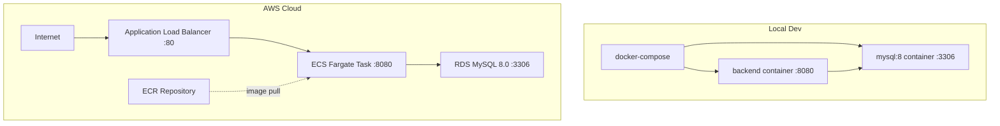

# Design Document — Docker & AWS ECS Deployment

## Overview

This design covers the full containerization and cloud deployment pipeline for MoneyTrack_BE. The application is a Spring Boot 4.0.5 / Java 17 REST API backed by MySQL. The deployment target is AWS ECS Fargate with RDS MySQL, fronted by an Application Load Balancer. Local development uses Docker Compose.

---

## Architecture



### Key Design Decisions

- Multi-stage Docker build keeps the final image lean (build tools not included in runtime image).
- ECS Fargate is chosen over EC2 to avoid managing servers.
- RDS MySQL is used instead of a MySQL container in ECS — managed backups, patching, and HA.
- ALB sits in public subnets; ECS tasks also run in public subnets with public IPs (simplest setup without NAT Gateway cost). RDS is in private subnets.
- Secrets (DB password, JWT secret) are passed as Terraform sensitive variables and injected as ECS task environment variables. For production hardening, these can be migrated to AWS Secrets Manager.

---

## Components and Interfaces

### 1. Dockerfile (multi-stage)

Stage 1 — `builder`:
- Base: `maven:3.9-eclipse-temurin-17`
- Copies `pom.xml` and `src/`, runs `mvn clean package -DskipTests`
- Output: `target/MoneyTrack_BE-0.0.1-SNAPSHOT.jar`

Stage 2 — `runtime`:
- Base: `eclipse-temurin:17-jre-alpine`
- Copies JAR from builder stage
- Exposes port 8080
- `ENTRYPOINT ["java", "-jar", "app.jar"]`
- Accepts env vars: `SPRING_DATASOURCE_URL`, `SPRING_DATASOURCE_USERNAME`, `SPRING_DATASOURCE_PASSWORD`, `SERVER_PORT`, `JWT_SECRET`

### 2. Docker Compose (local)

Services:
- `mysql` — mysql:8, named volume `mysql_data`, healthcheck via `mysqladmin ping`
- `backend` — built from Dockerfile, depends on mysql health, env vars from `.env`

`.env.example` documents all required variables.

### 3. Terraform File Structure

```
terraform/
├── provider.tf       # AWS provider + backend config
├── main.tf           # All resources (VPC, ECS, RDS, ALB, SGs)
├── variables.tf      # Input variables with descriptions/defaults
└── outputs.tf        # ALB DNS, ECR URL, RDS endpoint
```

### 4. Networking (VPC)

- CIDR: `10.0.0.0/16`
- 2 public subnets: `10.0.1.0/24` (AZ-a), `10.0.2.0/24` (AZ-b)
- 2 private subnets: `10.0.3.0/24` (AZ-a), `10.0.4.0/24` (AZ-b) — for RDS subnet group
- Internet Gateway attached to VPC
- Public route table: `0.0.0.0/0 → IGW`

### 5. Security Groups

| SG | Inbound | Outbound |
|----|---------|----------|
| `alb-sg` | TCP 80 from `0.0.0.0/0` | All |
| `ecs-sg` | TCP 8080 from `alb-sg` | All |
| `rds-sg` | TCP 3306 from `ecs-sg` | All |

### 6. ECR Repository

- Name: `moneytrack-be`
- Image tag mutability: MUTABLE (allows `latest` tag updates)
- Image scan on push: enabled

### 7. ECS Cluster & Task Definition

- Cluster name: `moneytrack-cluster`
- Task definition family: `moneytrack-be`
- Launch type: FARGATE
- CPU: 512 (0.5 vCPU), Memory: 1024 MB (configurable via variables)
- Container port: 8080
- Environment variables injected:
  - `SPRING_DATASOURCE_URL` → `jdbc:mysql://<rds_endpoint>:3306/<db_name>?useSSL=false&serverTimezone=UTC&allowPublicKeyRetrieval=true`
  - `SPRING_DATASOURCE_USERNAME`
  - `SPRING_DATASOURCE_PASSWORD`
  - `JWT_SECRET`
- IAM task execution role: `ecsTaskExecutionRole` (AWS managed policy `AmazonECSTaskExecutionRolePolicy`)

### 8. ECS Service

- Desired count: 1 (configurable)
- Network mode: `awsvpc`
- Subnets: public subnets
- Assign public IP: `ENABLED`
- Load balancer: ALB target group on port 8080
- Health check grace period: 60s

### 9. Application Load Balancer

- Scheme: internet-facing
- Subnets: both public subnets
- Listener: HTTP port 80 → forward to target group
- Target group: port 8080, protocol HTTP, health check path `/actuator/health` (or `/` if actuator not configured)
- Health check: 2 healthy threshold, 3 unhealthy threshold, 30s interval

### 10. RDS MySQL

- Engine: MySQL 8.0
- Instance class: `db.t3.micro` (configurable)
- Storage: 20 GB gp2
- DB name, username, password: from Terraform variables (password marked sensitive)
- Subnet group: private subnets
- Multi-AZ: false (dev/staging default; set to true for production)
- Publicly accessible: false
- Skip final snapshot: true (set to false for production)

---

## Data Models

No new data models are introduced by this spec. The deployment infrastructure consumes the existing application and its database schema (managed by Hibernate `ddl-auto=update` on first boot).

---

## Error Handling

| Scenario | Handling |
|----------|----------|
| Backend can't reach RDS on startup | Spring Boot fails fast with `DataSourceLookupFailureException`; ECS task stops and restarts per service restart policy |
| ALB health check fails | ECS service replaces unhealthy task automatically |
| Docker Compose MySQL not ready | `depends_on` with healthcheck condition `service_healthy` prevents backend from starting before MySQL is ready |
| Terraform apply partial failure | Terraform state tracks partial resources; re-running `terraform apply` is safe (idempotent) |

---

## Testing Strategy

### Local (Docker Compose)
- Run `docker-compose up` and verify the API responds on `http://localhost:8080`
- Confirm MySQL volume persists data across container restarts

### Infrastructure (Terraform)
- Run `terraform validate` and `terraform plan` before apply to catch config errors
- After apply, hit `http://<alb_dns>/` to confirm the API is reachable
- Check ECS service events in AWS Console for task health

### CI/CD (future)
- GitHub Actions or similar can automate: `mvn test` → `docker build` → `docker push ECR` → `terraform apply`

---

## Deployment Guide Location

A `DEPLOYMENT.md` file will be created at the project root covering:
1. Prerequisites (AWS CLI, Terraform, Docker)
2. Build & push Docker image to ECR
3. Terraform init / plan / apply
4. Retrieve public URL from outputs
