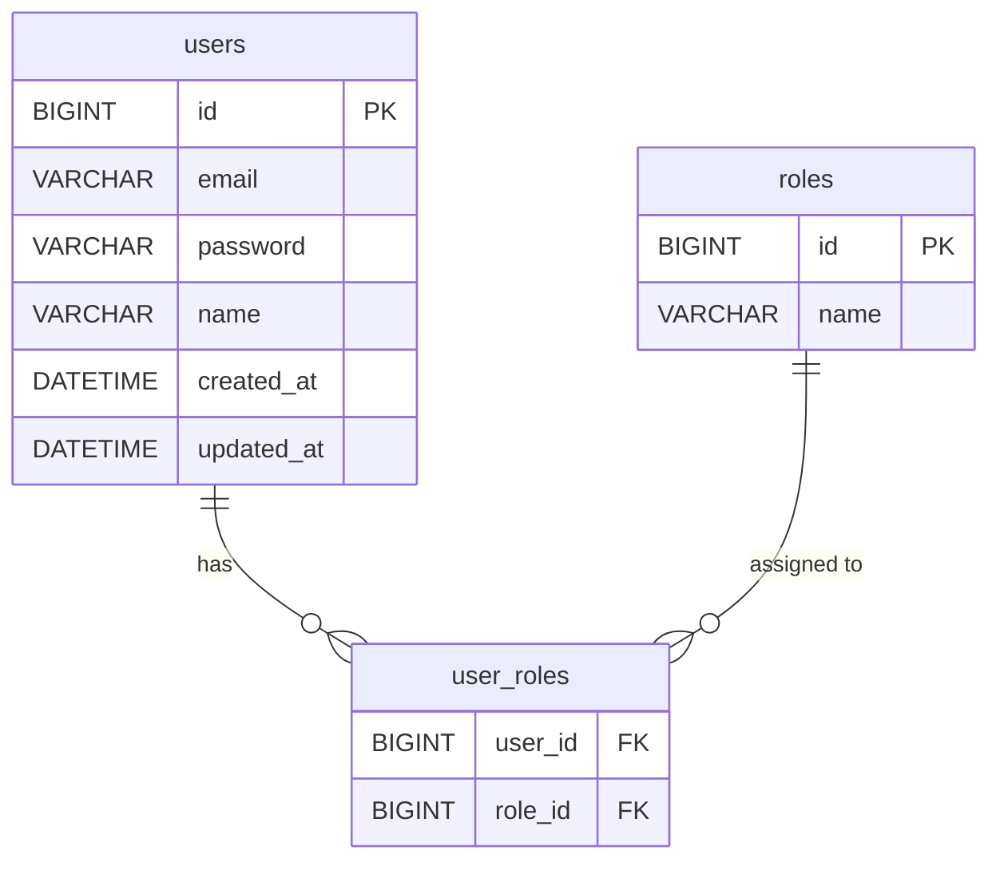

# Design Document: Role-Based Authentication

## Overview

This design extends the existing JWT-based authentication system in MoneyTrack_BE to support role-based access control (RBAC). The changes are additive — no existing APIs are broken. A new `Role` entity is introduced, linked to `User` via a many-to-many join table. Registration flows are updated to auto-assign roles, the login response is extended to include roles, and Spring Security authorities are populated from the user's roles.

---

## Architecture

The change touches the following layers:

```
Controller  →  AuthController (updated + new endpoint)
Service     →  AuthService (updated)
Repository  →  RoleRepository (new)
Entity      →  Role (new), User (updated)
DTO         →  AuthResponse (updated)
Security    →  UserDetailsServiceImpl (updated)
```

No new infrastructure is required. JPA auto-DDL will create the `roles` and `user_roles` tables on startup.

---

## Components and Interfaces

### Role Entity (`entity/Role.java`)

A simple entity with an `id` and a `name` backed by an enum.

```java
@Entity
@Table(name = "roles")
public class Role {
    @Id @GeneratedValue(strategy = GenerationType.IDENTITY)
    private Long id;

    @Enumerated(EnumType.STRING)
    @Column(nullable = false, unique = true)
    private RoleName name;
}
```

### RoleName Enum (`enums/RoleName.java`)

```java
public enum RoleName {
    USER, ADMIN
}
```

The `enums` package already exists in the project, so this fits naturally.

### User Entity (updated)

Add a `roles` field with a `@ManyToMany` mapping to the `user_roles` join table. Use `FetchType.EAGER` so roles are always available when the user is loaded (the user set is small and roles are needed on every authenticated request).

```java
@ManyToMany(fetch = FetchType.EAGER)
@JoinTable(
    name = "user_roles",
    joinColumns = @JoinColumn(name = "user_id"),
    inverseJoinColumns = @JoinColumn(name = "role_id")
)
private Set<Role> roles = new HashSet<>();
```

### RoleRepository (`repository/RoleRepository.java`)

```java
public interface RoleRepository extends JpaRepository<Role, Long> {
    Optional<Role> findByName(RoleName name);
}
```

### AuthService (updated)

Two changes:
1. `register()` — after saving the user, find or create the `USER` role and assign it.
2. `registerAdmin()` — same flow but with the `ADMIN` role.
3. `login()` — return an `AuthResponse` that includes the user's role names alongside the token.

A private helper `findOrCreateRole(RoleName)` avoids duplication between the two register methods.

### AuthController (updated)

- Existing `POST /api/auth/register` — no signature change, still returns `201`.
- New `POST /api/auth/register-admin` — same request body (`RegisterRequest`), returns `201`.
- `POST /api/auth/login` — return type stays `AuthResponse`, but the DTO now carries a `roles` list.

### AuthResponse DTO (updated)

```java
@Data
@AllArgsConstructor
public class AuthResponse {
    private String token;
    private List<String> roles;
}
```

The existing single-arg constructor is replaced; callers (only `AuthController.login`) are updated accordingly.

### UserDetailsServiceImpl (updated)

Map each `Role` on the `User` to a `SimpleGrantedAuthority` with the `ROLE_` prefix:

```java
user.getRoles().stream()
    .map(role -> new SimpleGrantedAuthority("ROLE_" + role.getName().name()))
    .collect(Collectors.toList());
```

This feeds directly into `JwtAuthFilter`, which already passes `userDetails.getAuthorities()` into the `SecurityContext` — so no changes are needed in the filter.

---

## Data Models

### Entity Relationship



### Tables Created by JPA (auto-DDL)

| Table        | Columns                          |
|--------------|----------------------------------|
| `roles`      | `id`, `name`                     |
| `user_roles` | `user_id` (FK), `role_id` (FK)   |

---

## Error Handling

| Scenario | Behavior |
|---|---|
| Email already registered (register or register-admin) | Existing `BadRequestException` — HTTP 400 |
| Role not found in DB | `findOrCreateRole` creates it — no error thrown |
| Login with bad credentials | Existing `BadCredentialsException` — HTTP 401 |

No new exception types are needed.

---

## Testing Strategy

- Unit test `AuthService.register()` — verify `USER` role is assigned and created if absent.
- Unit test `AuthService.registerAdmin()` — verify `ADMIN` role is assigned and created if absent.
- Unit test `AuthService.login()` — verify `roles` list is populated in `AuthResponse`.
- Unit test `UserDetailsServiceImpl.loadUserByUsername()` — verify authorities include `ROLE_USER` / `ROLE_ADMIN`.
- Integration test `POST /api/auth/register` — verify HTTP 201 and role assignment in DB.
- Integration test `POST /api/auth/register-admin` — verify HTTP 201 and `ADMIN` role in DB.
- Integration test `POST /api/auth/login` — verify response contains `token` and `roles`.
